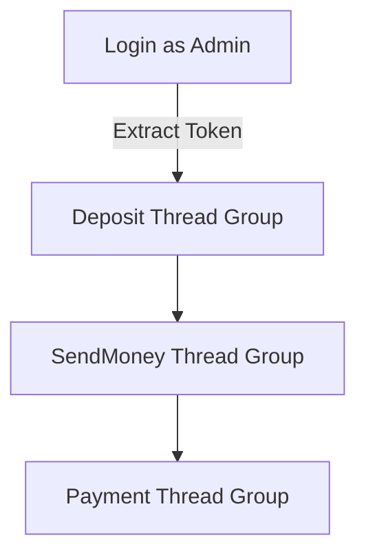

# 🔗 Dmoney API Chaining with Apache JMeter

## 📝 Project Overview

This project demonstrates a robust API chaining strategy using **Apache JMeter**, designed to validate a financial system’s transaction flow in **Dmoney**. The test flow simulates:

- ✅ Admin Login (Token generation)
- 💸 Agents deposit funds to customers
- 🔄 Customers send money to others
- 🏪 Customers pay merchants

All steps share a dynamic token, use external test data, and validate responses with assertions—emulating a real-life fintech environment.

---

## 🔧 Tools & Technologies

| Tool/Platform      | Purpose                               |
|--------------------|----------------------------------------|
| Apache JMeter       | API performance testing, chaining     |
| CSV Data Config     | Load dynamic user/account data        |
| JSON Extractor      | Extract tokens from login response    |
| Header Manager      | Pass Authorization token              |
| Response Assertion  | Verify response body/status           |
| HTML Report         | Generate test summary                 |

---

## 🧾 Test Plan Design

- **Threads**: 3 total
  - Agent Deposit
  - Customer Send Money
  - Customer Payment to Merchant
- **Ramp-Up**: 120 seconds per group
- **Loops**: Configurable (default = 1)
- **Token Reuse**: Single admin login → token shared via JMeter Variable
- **Assertions**: Status Code `200` and success message

---

## 🔄 Chaining Flow

🧬 Flow Summary
👨‍💼 5 Agents → deposit to 10 Customers

🔁 5 Customers → send money to 10 Customers

🏦 5 Customers → pay 2 Merchants
