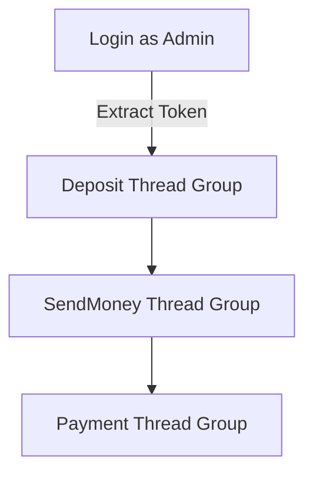

# 🔗 Dmoney API Chaining with Apache JMeter

## 📝 Project Overview

This project demonstrates a robust API chaining strategy using **Apache JMeter**, designed to validate a financial system’s transaction flow in **Dmoney**. The test flow simulates:

- ✅ Admin Login (Token generation)
- 💸 Agents deposit funds to customers
- 🔄 Customers send money to others
- 🏪 Customers pay merchants

All steps share a dynamic token, use external test data, and validate responses with assertions—emulating a real-life fintech environment.

---

## 🔧 Tools & Technologies

| Tool/Platform      | Purpose                               |
|--------------------|----------------------------------------|
| Apache JMeter       | API performance testing, chaining     |
| CSV Data Config     | Load dynamic user/account data        |
| JSON Extractor      | Extract tokens from login response    |
| Header Manager      | Pass Authorization token              |
| Response Assertion  | Verify response body/status           |
| HTML Report         | Generate test summary                 |

---

## 🧾 Test Plan Design

- **Threads**: 3 total
  - Agent Deposit
  - Customer Send Money
  - Customer Payment to Merchant
- **Ramp-Up**: 120 seconds per group
- **Loops**: Configurable (default = 1)
- **Token Reuse**: Single admin login → token shared via JMeter Variable
- **Assertions**: Status Code `200` and success message

---

## 🔄 Chaining Flow


  
🧬 Flow Summary
- 👨‍💼 5 Agents → deposit to 10 Customers
- 🔁 5 Customers → send money to 10 Customers
- 🏦 5 Customers → pay 2 Merchants

---

⚙️ How to Run

1. Clone the Repository
```
git clone https://github.com/MdRafsanMahmud/Dmoney_Jmeter-API-chaining.git
cd Dmoney_Jmeter-API-chaining
```
2. Open in Apache JMeter
- Version: v5.6.3 or higher
- Load dmoney.jmx file
- Ensure the following files are present in the same directory:
  - deposit.csv
  - sendMoney.csv
  - payment.csv

3. Run the Test Plan
- Click ▶️ in JMeter
- Admin login executes once
- Token shared via variable across all threads

---

📁 Project Structure

| File/Folder     | Description                             |
| --------------- | --------------------------------------- |
| `dmoney.jmx`    | Main test plan with all thread groups   |
| `deposit.csv`   | Agent → Customer deposit data           |
| `sendMoney.csv` | Customer → Customer send money data     |
| `payment.csv`   | Customer → Merchant payment data        |
| `reports/`      | Auto-generated HTML report              |
| `screenshots/`  | Visuals of test results and performance |

---

📸 Sample Report

| View JMeter HTML Reports for response time, throughput, and transaction success rate
📂 reports/html-report/index.html

---

🤝 Contributors
- Mohammad Arefin Hossain – Creator, QA Enthusiast
🔗 LinkedIn
- Salman Rahman – Reviewer
🔗 LinkedIn

---

⭐ Final Thoughts

This project reflects proficiency in:
- 🧩 API chaining with real-world financial logic
- 📊 Data-driven testing with CSV
- ✅ Assertions to ensure robustness
- 📄 Report generation for performance analysis

---

📬 **Contact Me**  
👤 Mohammad Arefin Hossain  
📧 arefinstudent71@gmail.com  
📞 +880 1840873217
🔗 [LinkedIn](https://www.linkedin.com/in/arefin-hossain/)
